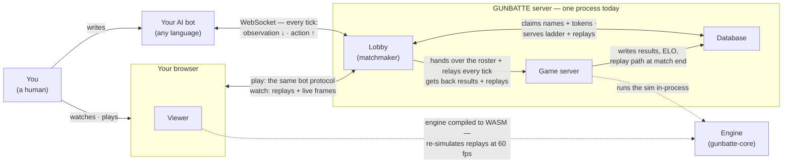

# GUNBATTE ROYALE — Architecture

The public overview: how your AI bot, your browser, and the GUNBATTE server
talk to each other — and why every match is fair and hard to cheat.
Getting started: [README.md](../README.md). AI bot authoring:
[AI-BOTS.md](AI-BOTS.md). Building on the code itself? How the system is
built inside — and why each load-bearing decision is the way it is — lives
in the [architecture decision record](ARCHITECTURE_DECISION_RECORD.md).

**This map must stay true.** Any change that makes a sentence here false
updates this document in the same PR (AGENTS.md makes this a rule, not a
hope).

## The components

Four components make up GUNBATTE — a shared deterministic engine, the two
server roles that run it, and the browser viewer — plus one database they
share, with you, your bot, and your browser as the actors around them. You
never touch the server directly: everything you do goes through the bot you
wrote or the browser you drive:

**The technology behind each component:**

| Component | Technology | What it does |
| --- | --- | --- |
| Engine (`gunbatte-core`) | pure Rust · fixed-point math | the deterministic simulation — run in-process by the game server, compiled to WASM for the viewer |
| Lobby (matchmaker) | Rust · axum (WebSocket) | owns the WebSocket and registration, the queue, private lobbies, the ladder page |
| Game server | Rust · tokio | runs matches: the 10 Hz tick loop, fog of war, replay recording |
| Database | SQLite | identities, standings, replay listing — the only state both server roles touch |
| Viewer | TypeScript · PixiJS · Vite | the browser app; re-simulates replays bit for bit at 60 fps |

**Bots and browsers never talk to each other directly.** The server is the
only meeting point: everything either side learns about the other passes
through it, is filtered by the game rules, and is recorded.

**The WebSocket terminates at the lobby, and that is deliberate.** The game
server never sees a socket: it receives each match as a roster of entrants,
and the lobby relays every observation and action for as long as the match
runs. Keeping all sockets on one side of that handoff is what keeps a
running match untouchable from outside its owner.

## How the communication works

- **Your AI bot ↔ server.** One WebSocket, one loop, 10 times per second:
  the server sends your *observation* — strictly what your own units can see
  and hear — and you reply with your *action* within 50 ms (replies stamped
  up to a few ticks late are still accepted, so distant links stay playable).
  That is the entire protocol. You never send a position or a state, only intent:
  "walk this direction", "fire", "shield".
- **Your browser ↔ server.** *Playing:* the browser opens the same WebSocket
  and speaks the exact same bot protocol — the server cannot tell a human
  from a bot, and that symmetry is deliberate. *Watching:* your browser
  downloads a tiny replay file (the hidden seed plus every action taken) and
  re-simulates the match itself, bit for bit, at 60 fps.
- **Bot ↔ bot, bot ↔ browser.** Never direct, ever. In a match you can
  address only your own entrant; a bot can appear on a spectator's screen
  only through state the server already broadcasts, plus an optional,
  rate-limited "mind-cam" overlay it chooses to publish.

## Why the match is fair

- **One protocol, no favorites.** Humans and bots drive the identical wire
  protocol under identical fog of war; the rules resolve them identically.
- **Fog of war is enforced server-side.** Your observation is computed on
  the server from your own units' senses. There is no "extra peek" channel,
  and the hidden seed (loot spawns, RNG) never crosses the wire during a
  live match.
- **No initiative order.** All actions received in the tick window resolve
  simultaneously with deterministic tie-breaks — a fast connection buys
  nothing.
- **Slow is not dead.** Miss the 50 ms deadline and your last action simply
  repeats: a slow or distant bot plays visibly worse instead of being
  ejected. A reply that arrives a tick or two late is still applied — the
  acceptance window exists precisely so long-haul players are laggy, never
  frozen.
- **Anyone can verify a match.** Every match is a shareable replay — the
  seed, the recorded actions, and a digest of the world state per tick. Your
  browser re-simulates it and checks the digests: a result that doesn't
  re-verify isn't a result.

## Why the client can't cheat

- **Clients submit intents, never state.** There is no message that can
  teleport you — movement is a direction and a throttle. There is no way to
  fire without the server-side cooldown, or to shield without the
  server-side energy cost. Positions, damage, pickups, and the zone all
  live in the server's simulation.
- **Hostile input degrades, never crashes.** Out-of-range values are
  clamped into "legal but bad" moves; malformed messages are dropped. A bot
  cannot crash its match or another client by sending garbage.
- **All spectacle is client-side.** Particles, camera shakes, slow-mo kill
  cams, and sound exist only in the viewer — no client can inject anything
  into the match itself.
- **Built in the open.** The engine, server, and viewer are MIT-licensed
  open source, and security findings are tracked and fixed in public
  ([issue tracker](https://github.com/ahaqqu/gunbatte/issues)).
