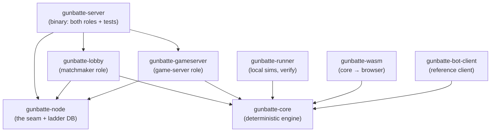

# GUNBATTE — Architecture Decision Record (for coding agents)

How the system is built inside, and **why** each load-bearing decision is
the way it is. This is the doc an agent reads before changing anything:
every section states the decision, the reason it exists, and what it buys —
so a change that violates a "why" knows it is renegotiating, not just
editing. The public-facing overview lives in
[ARCHITECTURE.md](ARCHITECTURE.md); the working rules live in
[AGENTS.md](../AGENTS.md); the operational limit map is
[LIMITS.md](../LIMITS.md).

**This record must stay true.** Any change that makes a sentence here false
— crates and roles, the seam, the wire protocol, identity and tiers,
determinism guarantees, security boundaries, the scale-out contract, the
known debts — updates this document in the same PR (AGENTS.md makes this a
rule, not a hope). When a decision here is *reversed*, the section is
rewritten to record the new decision and the reason the old one gave way —
the whys are the point, not the prose.

## The design pillars, and why each exists

1. **Determinism above all.** One simulation, one seed: the same recorded
   inputs produce the same world state — and the same per-tick digest — on
   the server, in CI, and in a browser. *Why:* it buys three things at once.
   Anyone can **verify** a match (re-simulate, compare digests — a result
   that doesn't re-verify isn't a result); **replays stay thin** (seed +
   actions, the world is recomputed on playback); and **spectating and
   player-cam rendering run the same engine** as the server. *How:* Q16.16
   fixed-point integers everywhere (no float drift between native and
   WASM), a single RNG seeded from the hidden seed inside the sim, no wall
   clock in sim code, sorted iteration and explicit tie-breaks.
2. **Server authority; clients send intent, never state.** There is no
   message that can teleport a unit: input is a heading, a throttle, and an
   action. Positions, damage, pickups, and the zone exist only in the
   server's simulation. *Why:* the cheat surface shrinks to "lie about
   intent", which the rules resolve fairly.
3. **Strict fog, enforced server-side.** Every bot's observation is sliced
   from the world by its own units' senses — sight plus coarse, quantized
   audio bearings. The seed (loot schedule, RNG) never crosses the wire
   during a live match. *Why:* scouting has value; a bot that reverse-
   engineers its JSON finds nothing it shouldn't know.
4. **Matchmaker ≠ game server.** Two roles with one narrow seam between
   them (below). *Why:* today they run in one process; when matches outgrow
   it, the seam becomes the assignment protocol and no lobby code changes.
5. **Graceful degradation over ejection.** Miss a 50 ms deadline and your
   last action repeats (momentum); miss too many and the timeout ladder
   forfeits you; stop reading observations and a disconnect grace counts
   down (and *recovers* the moment the link catches up); a half-open socket
   is reaped by keepalive pings. *Why:* a slow or distant bot should play
   visibly worse — not vanish mid-match and ruin it for everyone else. The
   reply stamp is enforced *windowed*
   (`--input-window-ticks`, default 10): a reply stamped up to 10 ticks
   late is still applied and only records its latency, so a long-haul human
   (RTT ≫ 50 ms — the own network measures ~195 ms) plays laggy instead of
   frozen, while only a tick with no reply at all counts toward forfeit.
   The window is the latency-vs-integrity dial: it bounds the staleness of
   applied inputs and keeps #53's replay surface closed. *Corollary:* the
   ladder forfeits the gone, not the distant. *Sharpened after the
   reliability incident (Oct 2026):* the chronic-slow forfeit was removed
   entirely — latency is a network condition, not misconduct, and the
   200 ms slow counter sat at the measured RTT of the box's own audience —
   disconnect grace grew to 30 s, and a stalled observation stream
   recovers instead of riding the grace to a forfeit. The full ordering
   principle lives in AGENTS.md ("Reliability outranks policing").
6. **Abuse resistance at the edges.** Every refusal the server can hand out
   is a deliberate ceiling (connection pool, lobby cap, new-name and
   wrong-code buckets, per-message size caps, name rules) so one client
   cannot farm the ladder or exhaust a small VPS. *Why and what to do when
   one bites:* [LIMITS.md](../LIMITS.md).
7. **Humans and bots are the same client.** The browser plays over the
   identical wire protocol under identical fog. *Why:* one code path to
   test, and no "human channel" to cheat through.
8. **Tests are the contract.** `crates/gunbatte-server/tests/gateway.rs`
   drives real sockets through the whole pipeline — registration, drafting,
   lobbies, the tick loop, idle timeouts, every security rule. A refactor
   that touches the seam keeps them green unchanged, or changes them as a
   deliberate protocol decision, never as a side effect.

## The crates, and what may depend on what

- **`gunbatte-core`** — the engine, pure and role-less: the tick pipeline
  (movement → dashes → projectile spawns → flight/impacts → abilities →
  zone → pickups → deaths), weapons, the loot schedule derived from the
  hidden seed, fog observation slicing, per-tick state digests, the replay
  format + recorder + verifier, timeout ladders. No I/O, no clock, no
  network.
- **`gunbatte-node`** — the seam, and nothing else: `MatchEntrant`/`BotMsg`
  (the roster handed from matchmaking into a match), `MatchContext`
  (replay dir, spectate sink, and the `rated` verdict — false when
  matchmaking topped a roster up with house bots), and `db::Db`, the ladder
  database that is the **only cross-role state**.
- **`gunbatte-lobby`** — the matchmaker role: the axum WebSocket gateway
  (`/ws/bot`, `/ws/spectate`), registration with door checks (name rules →
  new-name bucket → token door → one-live-name rule), identity tiers, the
  public queue, private lobbies with room codes, house-bot assembly at
  draft time, lane scheduling, the ladder/matches HTTP API, and spectator
  frames with the anti-cheat delay.
- **`gunbatte-gameserver`** — the game-server role: everything inside one
  match — the 10 Hz loop that pushes observations to every entrant
  simultaneously, collects replies in the tick window, drops stale-tick
  replies, feeds momentum/forfeit bookkeeping, records the replay, and
  writes results, placements, and ELO back through `MatchContext`.
- **`gunbatte-server`** — the deployment binary: both roles in one process,
  `GameHost` binding the lobby's `MatchHost` trait to the gameserver's
  `run_match`, and the end-to-end test suite.
- **`gunbatte-runner`** — local, headless: reference-bot matches to a
  replay file, replay verification, and a dev server.
- **`gunbatte-wasm`** — the *same* core compiled for the browser:
  `ReplaySim` re-simulates a replay tick by tick for playback and renders
  player-cam views through the engine's own fog. *Why:* replays stay thin
  and what a spectator sees is exactly what happened.
- **`viewer/`** — the TypeScript client: live play (the bot protocol from a
  browser), spectating, replay playback, HUD and mind-cam rendering.

The hard rules and their enforcement live in [AGENTS.md](../AGENTS.md): no
lobby ↔ gameserver dependency anywhere (not even dev-dependencies), one
match owned by one process for its whole life, the match loop never
touching lobby/queue state mid-match, identity claims under database
serialization at lock-in, and features that seem to need both roles
routing through the seam or stopping at an issue.

## How a match happens, end to end

1. **Connect + register.** A socket opens on `/ws/bot`. The first message
   registers a name; the door checks run in order: name valid → new-name
   bucket (first-seen names only) → token door (claimed names must present
   their issued secret; unclaimed names must present none) → one live
   connection per name. *Why this order:* the bucket throttles ladder row
   creation before any identity work happens; the token door refuses
   strangers before the connection-count rule could leak that a name is
   live. The ack carries the tier and, on first enrollment, the
   server-issued secret.
2. **Wait.** Either the public queue or a private room (host, invitees,
   room codes — wrong-code guesses draw from a global bucket).
3. **Draft.** A free lane (a semaphore slot) starts a match; matchmaking
   tops the roster up to size with **house bots** when humans are waiting
   — and marks the match **unrated** if it did. The roster is handed over
   as `MatchEntrant`s: name, db id, decision rate, auto-heel flag, a
   connected flag, and the socket's channels. That handoff is the seam;
   after it, the match loop never asks the lobby for anything.
4. **Play.** The game role runs the 10 Hz loop: push this tick's strict-fog
   observation to every entrant at once → collect replies until the window
   closes (replies stamped up to `--input-window-ticks` older still apply;
   older or future stamps are dropped) → apply momentum for misses →
   step the deterministic sim → digest the world → publish the spectator
   frame (delayed, below). The timeout ladder records misses — a
   late-but-accepted reply is not one; forfeits are
   deterministic in run and replay.
5. **Settle.** Placements (dead bots ranked at death, survivors at match
   end), pairwise multiplayer ELO (K=32 rated, 0 unrated), the replay file
   (`seed + config + raw inputs + per-tick digests`), and the ladder rows —
   all written back through `MatchContext`. Survivors stay connected and
   are requeued by the matchmaker; no re-registration.

## Identity and persistence

Identity is a name; the ladder, ELO, and history hang on it. Two tiers
(issue #42): **casual** (tokenless, off-ladder, disposable — the one-line
onboarding) and **rated** (on the ladder, protected by a 128-bit
server-issued secret delivered in the registration ack, never
client-chosen). A name holds at most one live connection. Every claim
happens under the database's lock at lock-in on the matchmaker side — no
other component invents or rotates identity. *Why claim-once with issued
secrets:* the ladder must not be farmable or hijackable, while fun-first
onboarding stays zero-effort; the tier split is how both hold.

SQLite (WAL, local disk) holds bots, matches, and placements. The moment
game servers move to separate machines is also the move to Postgres — the
database interface is the migration path.

## Spectating, replays, and the mind-cam

- **Spectator frames** flow through one broadcast channel; each spectator
  connection replays them `spectate_delay_s` behind live. *Why the delay:*
  watching live must not become an oracle for a bot or a bettor — the
  same reason the seed is hidden mid-match.
- **Replays** are the seed, config, raw inputs, and per-tick digests. The
  verifier re-submits the inputs through the engine and compares every
  digest; the WASM viewer does the same in the browser at 60 fps.
- **The mind-cam** is a bot-published, rate-limited (every 5 ticks,
  ≤4096-byte) 64×64 belief heat map — write-only overlay for viewers. It
  can lie; it is decoration, not state.

## Live-play rendering: dead reckoning, not interpolation

- **Live unit positions are extrapolated, not interpolated.** Between the
  10 Hz observations the play client carries every rendered unit forward
  along its last reported velocity (`viewer/src/render/deadreckon.ts`):
  120 ms cap, corrections blended out over ~100 ms, a hard snap only past
  48 units (respawn, re-entry), and a full freeze when snapshots stop —
  a stalled link must never send sprites flying. Sprites, fog holes, and
  the camera all consume the same carried-forward positions.
- *Why extrapolation and not the industry-default interpolation:* the big
  shooters interpolate remote players because their servers run lag
  compensation — the server rewinds hit validation to what the shooter
  saw, paying back the ~100 ms the interpolation added. This game's
  server resolves bullets against where enemies actually are (rewind
  would rewrite the projectile model, feed per-player network history
  into a deterministic sim, and break thin replay verification), so
  interpolated enemies would render ~100 ms deeper in the past with
  nothing paying for it. Extrapolation keeps what you aim at close to
  what the server will resolve; the cost is a bounded slide when someone
  stops or turns. If lag compensation is ever built, this decision is
  the one to revisit.
- **Play input rides a 50 ms heartbeat, not observation arrival.** Input
  used to be sampled only when an observation arrived, so a stalled link
  stalled input too — fewer observations meant fewer inputs, compounding
  exactly when the link was worst. The heartbeat keeps input flowing;
  the server already accepts stale tick stamps (`input_window_ticks`)
  and repeats the last move when a tick arrives empty (momentum fill),
  so the extra sends need no server change. Observation arrival remains
  a fast path for freshness.
- **Your own units are predicted, not just extrapolated.** The play
  client steps its own main and companion through `gunbatte-core`'s
  movement oracle (`predict.rs`, exposed to the browser by the WASM
  crate's `MoveSim`) every frame — the same velocity math, wall
  resolution, leash, ability gates, and own-pair separation the server's
  `step()` runs, proven bit-exact by the `predict_fidelity` test. A
  keypress therefore moves you within one frame; each observation
  reconciles the drift through the same blended correction the dead
  reckoner uses. Fog is no obstacle: a unit's movement depends only on
  its own input, the static map (embedded in the core, shared with the
  server), and its own flags. The one blind spot is separation against
  unseen enemies — the own main↔companion pair is predicted exactly; an
  enemy's push is a misprediction the reconcile absorbs. Enemies (their
  input is not ours to predict) keep plain velocity dead reckoning.
- *Why not go further (rewind, higher tick rates):* still out of scope.
  Prediction moved the feel problem client-side; the server's contract
  (10 Hz, authoritative, replay-verified) is untouched.

## Security model — what each guard is for

- **Input clamping at the door** ("legal but bad"): throttle clamped to
  0..=1, aim targets clamped far outside the arena (±2^40) with a
  wide-typed delta at the shot site (#40) — hostile input degrades, never
  panics, and release determinism doesn't rest on wrapping accidents.
- **The windowed reply stamp** (`--input-window-ticks`, default 10;
  strict-exact under #53, windowed after long-haul humans were provably
  frozen by the 50 ms gate, widened to ≈1 s of one-way latency by the
  reliability doctrine): a reply stamped more than the window older
  than the tick being decided — or from the future — is dropped, so a held
  or replayed decision can neither apply nor displace fresher input, and
  the staleness of anything applied is bounded by the window. Acceptance
  inside the window is *not* a ladder miss: the ladder forfeits the gone,
  not the distant.
- **Per-message caps** (64 KiB both WebSocket upgrades, #41): the largest
  legal message is a ~17 KiB mind-cam; axum's 64 MiB default was pure
  griefing surface that degraded *other* matches' deadlines. Oversize →
  the stream errors → the normal disconnect path.
- **The token door + one-live-name** (#36, #42): no name hijack, no
  duplicate-draft double-attribution, no room confusion by name spoofing.
  The one-live-name check *evicts* for the verified owner (correct token →
  the newer connection wins; Oct 2026): the rule keeps two same-name
  entrants out of one match without ever letting a hung socket hold a
  name hostage.
- **Origin allowlist** (#38): browsers always send `Origin` on WebSocket
  handshakes; a hostile page in another tab can't open sockets in a
  player's name. Non-browser clients send no Origin and are allowed.
- **Multi-byte-safe truncation, global abuse buckets, connection and
  lobby ceilings** (#36–#38 family): the small-VPS survival kit; LIMITS.md
  is the operations map.
- **Transport/deployment:** TLS at nginx, CSP on the viewer, a systemd
  hardening cage around the binary — box-level facts live in the shared
  VPS manifest (ahaqqu/homepage → `provision/vps/MACHINE.md`), not here.

## The scale-out contract (why the seam exists)

When matches outgrow one process: one matchmaker, N game servers.
Refactoring stays bounded to the seam only if these hold:

- The matchmaker picks a game server from a heartbeat registry (address,
  free lanes) and assigns the match: match id, roster of verified
  identities, a one-time short-lived ticket, a gather window.
- Members are forwarded, not proxied: each client reconnects to the game
  server with its ticket. Match traffic never passes through the
  matchmaker. `MatchHost` — today a trait bound to an in-process function
  — becomes that assignment protocol, and no lobby code changes.
- The game server writes results, placements, ELO, and the replay path to
  the shared database. That is its only output contract.
- Failure policy: gather timeout → house fill or abort to the queue;
  game-server death mid-match → the match aborts with no ELO change.
  Live matches are never migrated.
- SQLite holds while every process shares one machine (WAL, local disk);
  separate machines for game servers is also the move to Postgres.

## Journal events (the troubleshooting contract)

Every operationally important event prints one structured line to stdout
(journald under the systemd unit): a stable snake_case event token plus
`key=value` fields, cataloged in [LIMITS.md](../LIMITS.md). High-rate paths
log state changes and per-match aggregates only — `input_late_accepted`
fires on an entrant's first windowed reply, `input_summary` closes each
match per entrant — so a busy box stays greppable without 10 Hz flooding.
The current catalog: `match_started`, `match_over`, `input_late_accepted`,
`input_dropped_stale`, `input_summary`, `obs_stall`, `obs_recovered`,
`disconnect`, `ladder_forfeit`, `register_refused`, `register_evicted`,
`lobby_join_failed`; phase-2 grace
re-attach adds `reattach_granted` / `reattach_expired`. New operational
behavior ships with its event in the same PR — this is the record ops
reconfigures from (issue #71 holds the re-attach policy).

## Known debts (deliberate; don't entrench them)

- Spectate frames flow through one global broadcast channel the lobby owns
  and passes via `MatchContext`. Per-match channels owned by whoever runs
  the match is the scale-out shape.
- House bots are assembled by the matchmaker but run in matches — fine as
  long as they enter only as ordinary entrants on the roster; the types
  enforce it.
- `replays/match-<millis>.json` naming assumes a single writer; multiple
  processes need collision-safe, host-aware replay paths.
- The dead files under `crates/gunbatte-server/src/` (`db.rs`, `house.rs`,
  `page.rs`) predate the role split and are not in the module tree.
- A casual row still accrues rating and record in rated matches
  (`record_match` writes every entrant; the match-level `ctx.rated` sets
  K, not the row's tier) — the standings filter hides the row, nothing
  protects what it banks, and whoever enrolls the name inherits it. The
  per-row fix and its semantics questions live in issue #66.
- Auto-heel has no hand-back: the engine substitutes `Heel` for the
  companion every tick while the flag is on, and `companion_cmds` —
  counted for exactly this opt-out — is never read. Doc'd as "commands
  are ignored" in AI-BOTS.md; the behavioral fix lives in issue #67.

## Where to change what

| You're touching… | Start at |
|---|---|
| game rules, weapons, zone, loot, fog, replays | `gunbatte-core` (+ its tests; digest discipline applies) |
| registration, queue, lobbies, ladder, limits, identity | `gunbatte-lobby` (+ `gunbatte-node/db`) |
| the tick loop, deadline/forfeit handling, results write-back | `gunbatte-gameserver` |
| anything crossing roles | the seam in `gunbatte-node` — widen it deliberately, never bridge it |
| deployment, nginx, systemd, TLS | the box manifest first (AGENTS.md), then `provision/` |
| bot-facing protocol | [AI-BOTS.md](AI-BOTS.md) + [ARCHITECTURE.md](ARCHITECTURE.md), in the same PR |
